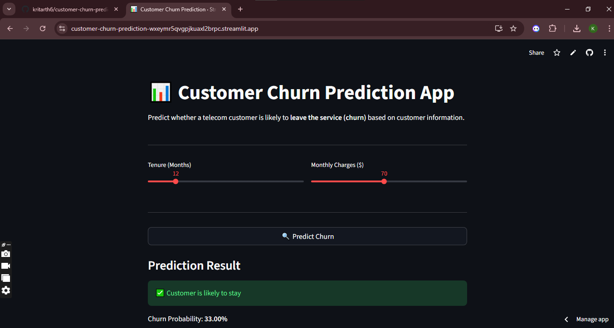

# 📊 Customer Churn Prediction (Machine Learning + Deployment)

This project builds a **Machine Learning model to predict customer churn** in a telecom company and deploys it as an interactive **Streamlit web application**.

The goal is to identify customers who are likely to leave the service so that businesses can take proactive retention actions.

---

# 🚀 Live Demo

Streamlit App:
(https://customer-churn-prediction-wxeymr5qvgpjkuaxl2brpc.streamlit.app/)

---

# 📷 Application Screenshot



---

# 📌 Project Overview

Customer churn prediction is an important business problem for telecom companies. Losing customers directly impacts revenue, so companies use **machine learning models** to predict which customers are likely to churn.

In this project:

* A machine learning model is trained using a telecom customer dataset
* Features such as **tenure and monthly charges** are used for prediction
* The model is deployed as a **web application using Streamlit**
* Users can interactively input customer details and receive churn predictions

---

# 🧠 Machine Learning Workflow

1. Data preprocessing and feature preparation
2. Train-test split
3. Model training using **Random Forest Classifier**
4. Model evaluation
5. Model serialization using **Joblib**
6. Deployment with **Streamlit**

---

# ⚙️ Tech Stack

Programming Language

* Python

Machine Learning

* Scikit-learn
* Random Forest Classifier

Data Processing

* Pandas
* NumPy

Model Deployment

* Streamlit

Model Serialization

* Joblib

---

# 📂 Project Structure

```
customer-churn-prediction
│
├── app.py                # Streamlit web application
├── model.pkl             # Trained machine learning model
├── train_model.ipynb     # Model training notebook
├── requirements.txt      # Python dependencies
└── README.md             # Project documentation
```

---

# 🖥️ Running the Project Locally

Install dependencies

```
pip install -r requirements.txt
```

Run the Streamlit app

```
streamlit run app.py
```

---

# 📈 Model Features Used

The model currently uses the following customer attributes:

* Tenure
* Monthly Charges

These features are used to estimate the probability that a customer will churn.

---

# 📊 Output

The application predicts whether a customer is likely to:

* Stay with the company
* Churn (leave the service)

It also displays the **probability of churn** based on the trained model.

---

# 💡 Future Improvements

* Add more customer features for better prediction accuracy
* Implement advanced models like **XGBoost or LightGBM**
* Add data visualizations to the Streamlit dashboard
* Deploy using **Docker or cloud platforms**

---

# 👨‍💻 Author

Kritarth Joshi

GitHub
https://github.com/kritarth6
